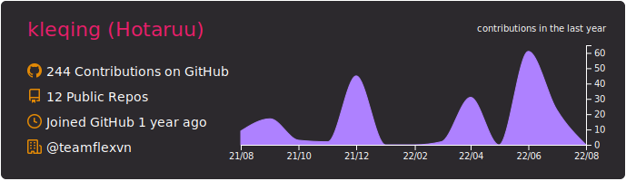
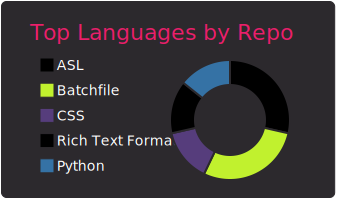
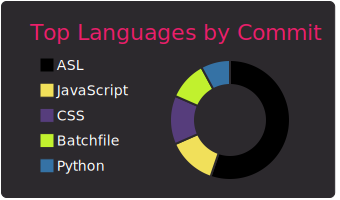
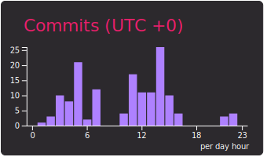

## monokai

[](https://github.com/kleqing/kleqing-summary-card)
[](https://github.com/kleqing/kleqing-summary-card) [](https://github.com/kleqing/kleqing-summary-card)
[](https://github.com/kleqing/kleqing-summary-card) [](https://github.com/kleqing/kleqing-summary-card)
### Now you can add this to your markdown
```

[](https://github.com/kleqing/kleqing-summary-card)
[](https://github.com/kleqing/kleqing-summary-card) [](https://github.com/kleqing/kleqing-summary-card)
[](https://github.com/kleqing/kleqing-summary-card) [](https://github.com/kleqing/kleqing-summary-card)

```

### Each card usage
---


```

```

    

---


```

```

    

---


```

```

    

---


```

```

    

---


```

```

    
